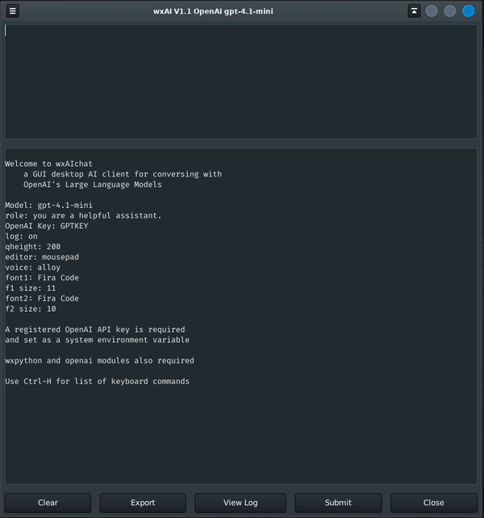

# wxAIchat
## wxPython GUI with OpenAI LLM in Chat mode

_GUI desktop AI client for conversing with
    OpenAI's Large Language Models_
    

### wxAIchat runs on Linux and Windows.

For audio replay of responses on Linux `mpv` must installed.

        sudo apt install mpv

Windows does not require an additional audio player.

In addition to python 3.x two other needed modules are:

        pip install openai
        pip install wxPython
        
### Keyboard Commands

        Ctrl-H     This help message
        Ctrl-F     Find text
        Ctrl-N     Find next
        Ctrl-Q     Quit App
        Ctrl-G     Execute AI request
        Ctrl-O     Open options in editor
        Alt-Ctrl-V Toggle voice
        Alt-Ctrl-C Copy Code in Markup

### options.ini file

        # wxAIchat.py
        openai=GPTKEY
        model=gpt-4.1-mini
        role=you are a helpful assistant.
        log=on
        fontsz1=11
        font1=Fira Code
        fontsz2=10
        font2=Fira Code
        editor=mousepad
        qheight=200
        voice=alloy
        
        #   voices: 'alloy','ash','ballad','coral','echo','fable','nova','onyx','sage','shimmer'

